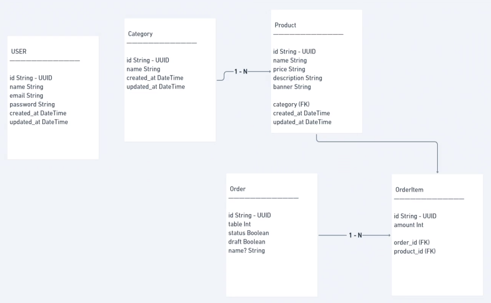

# Backend da Aplicação Pizzaria 🔥
Este é o backend da nossa incrível aplicação para uma pizzaria! Aqui, serão implementadas todas as funcionalidades relacionadas ao gerenciamento de pedidos e criação de pizzas.

## Tecnologias Utilizadas
* NodeJS
* Express
* TypeScript
* PostgreSQL
* JWT (JSON Web Token)

## Funcionalidades
Autenticação de usuários e geração de tokens JWT
CRUD (Create, Read, Update, Delete) de pedidos e pizzas
Gerenciamento de mesas e comandas
Criação de middlewares para autenticação e validação de requisições
## Banco de Dados
O banco de dados escolhido para armazenar as informações da aplicação é o PostgreSQL, que oferece alta performance e robustez para aplicações de larga escala.

## Autenticação e Segurança
A autenticação de usuários será feita através de tokens JWT, garantindo assim a segurança das informações e acesso somente aos usuários autorizados. Além disso, serão implementados middlewares para validar as requisições e garantir que somente as ações permitidas sejam executadas.

Em resumo, este backend da aplicação pizzaria é uma solução completa, segura e performática para gerenciar os pedidos e criação de pizzas da sua pizzaria.


## Como rodar o backend

``` yarn ``` 

``` yarn dev ```

## Como criar uma migration


``` yarn prisma migrate dev ```


## Ferramentas úteis

1. Beekeeper Studio
2. Postbird
3. PostgreSQL

## Relacionamentos


